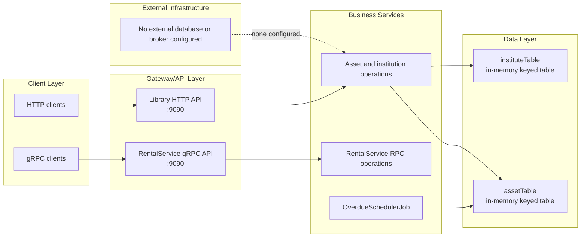

# Assignment 1 — Asset, Institution and Rental Services

This document describes the implemented Assignment 1 architecture. Evidence is in the Ballerina source, generated gRPC bindings and protobuf contract in this directory.

## Architecture overview



## Component catalog

| Component | Responsibility | Evidence |
| --- | --- | --- |
| `libraryService` | HTTP CRUD and filtering for assets and institutions, plus asset sub-resources | [service.bal](libraryService/service.bal) |
| `assetTable` | Stores assets keyed by `assetTag` | [repository.bal](libraryService/repository.bal#L4-L5) |
| `instituteTable` | Stores institutions keyed by `institutionId` | [repository.bal](libraryService/repository.bal#L7-L8) |
| `OverdueSchedulerJob` | Marks active or pending schedules overdue | [automatedJobs.bal](libraryService/automatedJobs.bal) |
| `RentalService` | gRPC contract for property, user, search and booking operations | [rental.proto](rental.proto#L281-L297) |
| Generated bindings | gRPC server/client message and stub support | [rentalservice_service.bal](modules/rentalService/rentalservice_service.bal), [rental_pb.bal](modules/rentalService/rental_pb.bal) |

## HTTP API entry points

The listener is created on port `9090` in [service.bal](libraryService/service.bal#L4).

### `/assets`

- `POST /assets`
- `GET /assets`
- `GET /assets/{assetTag}`
- `PUT /assets/{assetTag}`
- `DELETE /assets/{assetTag}`
- `GET /assets/overdue`
- `GET /assets/institute/{institutionId}`
- `GET /assets/site/{site}`
- `GET /assets/status/{status}`
- `GET /assets/filtered`
- Component, schedule and work-order sub-resources are implemented below `/assets/{assetTag}`.

The exact resource declarations and error mappings are in [service.bal](libraryService/service.bal#L16-L284).

### `/institutions`

- `POST /institutions`
- `GET /institutions`
- `GET /institutions/{id}`
- `PUT /institutions/{id}`
- `DELETE /institutions/{id}`

Evidence: [service.bal](libraryService/service.bal#L286-L327).

## gRPC API

The server listens on gRPC port `9090`, as declared in [rentalservice_service.bal](modules/rentalService/rentalservice_service.bal#L1-L6). The protobuf contract defines:

- `AddProperty`
- `UpdateProperty`
- `RemoveProperty`
- `CreateUsers` — client streaming
- `ListAvailableProperties` — server streaming
- `SearchProperty`
- `BookProperty`
- `ConfirmBooking`

Contract evidence: [rental.proto](rental.proto#L281-L297).

## Persistence and runtime behavior

There is no configured external database. `assetTable` and `instituteTable` are isolated in-memory tables, so state is process-local and is lost on restart. Evidence: [repository.bal](libraryService/repository.bal#L1-L8).

The HTTP service schedules `OverdueSchedulerJob` every 300 seconds. The job scans asset schedules and writes changed assets back to `assetTable`. Evidence: [service.bal](libraryService/service.bal#L8-L14) and [automatedJobs.bal](libraryService/automatedJobs.bal#L5-L30).

## Technologies and build configuration

- Ballerina distribution `2201.13.4`: [Ballerina.toml](libraryService/Ballerina.toml#L1-L9).
- HTTP: `ballerina/http`, [service.bal](libraryService/service.bal#L1-L4).
- gRPC and protobuf: [Dependencies.toml](Dependencies.toml#L50-L71), [rental_pb.bal](modules/rentalService/rental_pb.bal#L1-L2).
- Built-in Ballerina observability is included: [Ballerina.toml](libraryService/Ballerina.toml#L7-L9).

No Assignment 1 Dockerfile, Compose service, deployment manifest or CI/CD workflow exists.

## Development

From `Assignment-1/libraryService`, use the standard Ballerina package commands:

```powershell
bal build
bal test
bal run
```

The repository includes service tests under [libraryService/tests](libraryService/tests). The test client assumes `http://localhost:9090`, [service_test.bal](libraryService/tests/service_test.bal#L5).

## Verification notes

- Generated gRPC code must remain consistent with [rental.proto](rental.proto).
- The HTTP service and gRPC service both use port `9090`, but they are separate processes/listeners and cannot share the same host port when run simultaneously without a port change.
- The repository’s generic test template references `/greeting`, which is not an implemented Assignment 1 route; inspect [service_test.bal](libraryService/tests/service_test.bal#L15-L26) before relying on it.
