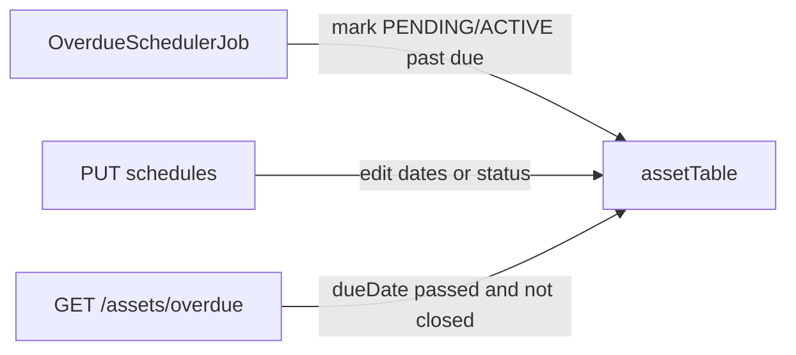

# Overdue detection and schedule PUT

## Current state

Background overdue detection is **already wired**, not commented:

- [`libraryService/service.bal`](Assignment-1/libraryService/service.bal) `init()` schedules `OverdueSchedulerJob` every 300s
- [`libraryService/automatedJobs.bal`](Assignment-1/libraryService/automatedJobs.bal) marks `PENDING`/`ACTIVE` schedules with `dueDate` in the past as `OVERDUE`
- `GET /assets/overdue` calls `findOverdueAssets()`

The commented block at the bottom of `service.bal` is a leftover **routine-service** snippet (`POST .../routine-service`). It is not overdue detection and should stay unused (optional delete later).

What is missing: **`PUT /assets/{assetTag}/schedules/{scheduleId}`**. The CLI schedule-update path is commented for that reason.

## Bug to fix first

`findOverdueAssets()` only matches `PENDING` or `ACTIVE` plus a past `dueDate`:

```261:275:Assignment-1/libraryService/repository.bal
public isolated function findOverdueAssets() returns Asset[] & readonly {
    // ... ACTIVE || PENDING && dueDate < now
}
```

After the job runs, those rows are `OVERDUE`, so the overdue dashboard goes empty. The brief asks to identify assets whose **due date has passed**, not only still-pending ones.

Treat a schedule as overdue when:

- `dueDate < now`
- status is **not** `COMPLETED` or `CANCELLED` (include `OVERDUE`, `PENDING`, `ACTIVE`)

Use that same rule in both `findOverdueAssets()` and the job (job still only writes `OVERDUE` when status is `PENDING`/`ACTIVE` so it does not rewrite already-overdue rows). Keep `GET /assets/overdue` as HTTP 200 with `[]` when nothing matches.

Optional for a live demo: drop the job interval from 300s to something like 30s so markers see status flip without waiting five minutes. Keep 300s if you prefer assignment-like timing.



## PUT: update an existing schedule

Follow the existing `WorkOrderUpdate` pattern (partial fields, path id wins). Do **not** accept a full `Schedule` body: the commented client currently sends dummy `startTime`/`dueDate`/`description`, which would wipe real data.

### 1. Types — [`libraryService/types.bal`](Assignment-1/libraryService/types.bal)

```ballerina
public type ScheduleUpdate record {|
    ScheduleType? scheduleType = ();
    ScheduleStatus? scheduleStatus = ();
    time:Utc? startTime = ();
    time:Utc? dueDate = ();
    string? description = ();
|} & readonly;
```

`scheduleId` stays on the path only (`readonly` on the stored record anyway).

### 2. Repository — [`libraryService/repository.bal`](Assignment-1/libraryService/repository.bal)

Add `updateSchedule(assetTag, scheduleId, ScheduleUpdate)`:

- 404 `AssetNotFound` / `ScheduleNotFound`
- 422 if the asset is `DISPOSED`
- If `dueDate` and `startTime` are both present after merge, reject when `dueDate <= startTime`
- Apply only non-nil fields, `put` the asset, return the updated `Asset` (same as `updateWorkOrder`)
- Keep parent asset status in sync when it is cheap and consistent with loan/return:
  - booking set to `COMPLETED`/`CANCELLED` and no other active/overdue booking → `AVAILABLE` if currently `OCCUPIED`
  - do **not** auto-set `OVERDUE` here; that stays the job’s job unless the client explicitly sets `scheduleStatus: OVERDUE`

Reuse existing error types in [`error.bal`](Assignment-1/libraryService/error.bal); add `InvalidAssetState` or a small validation error only if date-order needs a distinct 422.

### 3. HTTP — [`libraryService/service.bal`](Assignment-1/libraryService/service.bal)

Next to the existing POST/DELETE schedule resources:

`PUT /assets/{assetTag}/schedules/{scheduleId}` → map `AssetNotFound`/`ScheduleNotFound` to 404, disposed/invalid dates to 422, success to 200 with the asset body.

### 4. Client — [`libraryClient/service.bal`](Assignment-1/libraryClient/service.bal)

Re-enable menu option 2. Collect only the fields the user wants to change (blank = omit). Build a `ScheduleUpdate` JSON payload and `PUT /assets/{tag}/schedules/{id}`. Do not send placeholder dates.

Mirror `ScheduleUpdate` on the client (or send a `map<json>`) so omitted fields stay omitted.

## Out of scope

- Uncommenting the routine-service snippet
- Work-order CLI
- Changing `GET /assets/filtered` (already a path resource)

## Verification

- Create a schedule with `dueDate` in the past → job (or a short wait) sets `OVERDUE` → `GET /assets/overdue` still returns that asset
- `PUT` description/dueDate only; other fields unchanged
- `PUT` unknown scheduleId → 404
- CLI: Schedule Manager → Update Schedule against a live asset
