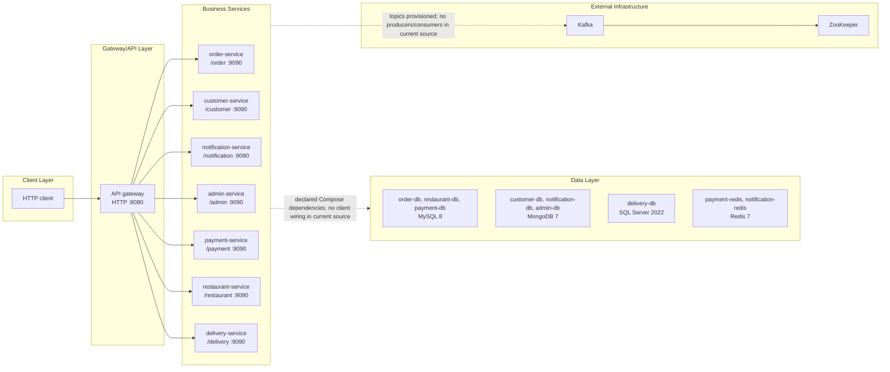
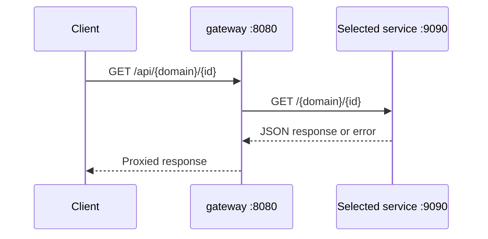
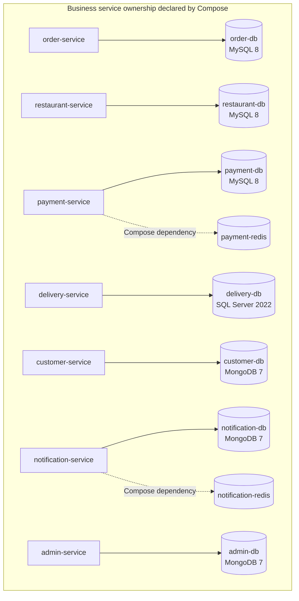
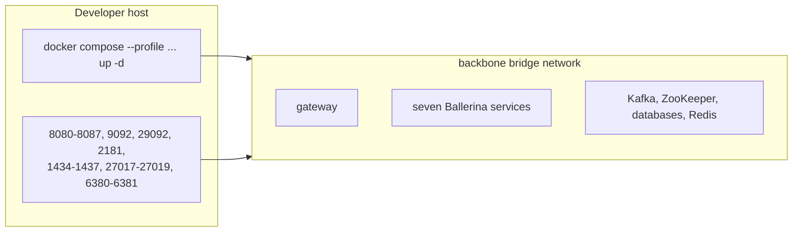

# Assignment 2 — Food Delivery Service Scaffold

This document describes the implemented Assignment 2 application and its local Docker infrastructure. It reflects actual repository wiring; provisioned infrastructure that is not currently referenced by source code is explicitly identified.

## Architecture overview



All components attach to the Docker bridge network `backbone`, [docker-compose.yml](infra/docker/docker-compose.yml#L4-L6).

## Component catalog and responsibilities

| Component | Current responsibility | Internal port | Host port | Evidence |
| --- | --- | ---: | ---: | --- |
| `gateway` | REST entry point and reverse proxy | 8080 | 8080 | [gateway/service.bal](gateway/service.bal#L5-L27) |
| `order-service` | `/order/health` only | 9090 | 8081 | [orderService/service.bal](services/orderService/service.bal#L7-L13), [Compose](infra/docker/docker-compose.yml#L127-L143) |
| `customer-service` | `/customer/health` only | 9090 | 8082 | [customerService/service.bal](services/customerService/service.bal#L5-L10), [Compose](infra/docker/docker-compose.yml#L145-L163) |
| `notification-service` | `/notification/health` only | 9090 | 8083 | [notificationService/service.bal](services/notificationService/service.bal#L5-L12), [Compose](infra/docker/docker-compose.yml#L184-L202) |
| `payment-service` | `/payment/health` only | 9090 | 8084 | [paymentService/service.bal](services/paymentService/service.bal#L5-L11), [Compose](infra/docker/docker-compose.yml#L220-L238) |
| `admin-service` | `/admin/health` only | 9090 | 8085 | [adminService/service.bal](services/adminService/service.bal#L5-L10), [Compose](infra/docker/docker-compose.yml#L165-L182) |
| `delivery-service` | `/delivery/health` only | 9090 | 8086 | [deliveryService/service.bal](services/deliveryService/service.bal#L5-L11), [Compose](infra/docker/docker-compose.yml#L273-L290) |
| `restaurant-service` | `/restaurant/health` only | 9090 | 8087 | [restaurantService/service.bal](services/restaurantService/service.bal#L5-L10), [Compose](infra/docker/docker-compose.yml#L240-L256) |

The seven business services are currently scaffolds. No CRUD, order, payment, notification, restaurant or delivery workflows are implemented in their `service.bal` files.

## Gateway routes and request flow



Routes are declared in [gateway/service.bal](gateway/service.bal#L27-L61):

| Gateway route | Client target | Internal downstream URL |
| --- | --- | --- |
| `GET /api/orders/{id}` | Order | `http://order-service:9090/order/{id}` |
| `GET /api/customer/{id}` | Customer | `http://customer-service:9090/customer/{id}` |
| `GET /api/notifications/{id}` | Notification | `http://notification-service:9090/notification/{id}` |
| `GET /api/payments/{id}` | Payment | `http://payment-service:9090/payment/{id}` |
| `GET /api/admin/{id}` | Admin | `http://admin-service:9090/admin/{id}` |
| `GET /api/delivery/{id}` | Delivery | `http://delivery-service:9090/delivery/{id}` |
| `GET /api/restaurant/{id}` | Restaurant | `http://restaurant-service:9090/restaurant/{id}` |
| `GET /api/health` | Gateway | Static gateway health response |

The service names are used as Docker DNS hostnames and `9090` is the container-side port, [gateway/service.bal](gateway/service.bal#L7-L17).

## Data and external infrastructure

### Database ownership



Compose declares these dependencies and volumes, but the current service source does not create database, Redis or messaging clients. Evidence: [docker-compose.yml](infra/docker/docker-compose.yml#L132-L195), [docker-compose.yml](infra/docker/docker-compose.yml#L225-L290), and the health-only service implementations.

Kafka topics are created by the one-shot `kafka-init` container from [create-topics.sh](infra/docker/kafka/create-topics.sh). Kafka runs with ZooKeeper coordination and plaintext listeners, [docker-compose.yml](infra/docker/docker-compose.yml#L36-L63).

## Docker and container architecture



All eight application images use the same two-stage Dockerfile pattern: Ballerina build image, `bal build --offline=false`, then Eclipse Temurin 21 JRE with the generated JAR. Evidence: [gateway/Dockerfile](gateway/Dockerfile#L1-L10) and the equivalent service Dockerfiles.

Named volumes are declared in [docker-compose.yml](infra/docker/docker-compose.yml#L426-L435):

- `order-db-data`
- `restaurant-db-data`
- `payment-db-data`
- `delivery-db-data`
- `customer-db-data`
- `notification-db-data`
- `admin-db-data`
- `payment-redis-data`
- `notification-redis-data`

## Profiles and ports

Every profile starts the shared gateway, Kafka, ZooKeeper and topic initializer. Application/database membership is defined in [docker-compose.yml](infra/docker/docker-compose.yml).

| Profile | Application services | Supporting services |
| --- | --- | --- |
| `order-customer` | order `8081`, customer `8082` | order MySQL `1434`, customer MongoDB `27017` |
| `notification-admin` | notification `8083`, admin `8085` | notification MongoDB `27018`, admin MongoDB `27019`, notification Redis `6381` |
| `restaurant-payment` | restaurant `8087`, payment `8084` | restaurant MySQL `1435`, payment MySQL `1436`, payment Redis `6380` |
| `delivery` | delivery `8086` | delivery MSSQL `1437` |
| `all` | all seven services | all databases and both Redis instances |

Shared host ports: gateway `8080`, Kafka `9092` and `29092`, ZooKeeper `2181`. Container-side application port is always `9090`.

## Configuration and secrets

[.env.example](infra/docker/.env.example) defines `COMPOSE_PROJECT_NAME`, database host ports, `MONGO_ROOT_USER` and `COMPOSE_PARALLEL_LIMIT`. [start-dev.ps1](infra/docker/scripts/start-dev.ps1#L15-L35) generates local database passwords into the ignored `.env`; no secret values are documented here.

The gateway has configurable Ballerina values for its port and downstream URLs, [gateway/service.bal](gateway/service.bal#L5-L17). Compose does not provide an explicit environment mapping for these values.

## Development setup

From `Assignment-2/infra/docker`:

```powershell
.\scripts\start-dev.ps1
```

The script creates `.env` if missing, generates local passwords once, prompts for a profile and runs Compose. Existing containers can be stopped/started with:

```powershell
.\scripts\stop-containers.ps1
.\scripts\start-containers.ps1
```

To remove selected profile volumes and reinitialize credentials:

```powershell
.\scripts\reset-dev-data.ps1
```

Do not expose or commit `.env`. Database initialization credentials are retained in persistent volumes; regenerating `.env` without resetting affected volumes can cause authentication failures.

## Health checks

Compose checks:

- Gateway: `GET http://localhost:8080/api/health`
- Services: `GET http://localhost:9090/<service>/health`
- Kafka with `kafka-topics`
- ZooKeeper with a TCP port probe
- MySQL with `mysqladmin`
- MongoDB with authenticated `mongosh`
- MSSQL with `sqlcmd`
- Redis with `redis-cli ping`

Evidence: [docker-compose.yml](infra/docker/docker-compose.yml#L21-L33), [docker-compose.yml](infra/docker/docker-compose.yml#L52-L63), and [docker-compose.yml](infra/docker/docker-compose.yml#L118-L424).

## Technologies and observability

- Ballerina HTTP services and gateway.
- Docker Compose and bridge networking.
- Confluent Kafka/ZooKeeper.
- MySQL 8, MongoDB 7, SQL Server 2022 and Redis 7.
- Java 21 JRE application runtime.
- Ballerina built-in observability included in each package, for example [gateway/Ballerina.toml](gateway/Ballerina.toml#L7-L9).

No metrics exporter, tracing backend, dashboard, alerting configuration or centralized logging configuration is present.

## Known inconsistencies

1. Compose contains a stale comment claiming the gateway uses `_service` downstream paths, but [gateway/service.bal](gateway/service.bal#L35-L60) uses the implemented short paths.
2. Application health checks invoke `curl`, but the minimal runtime Dockerfiles do not install `curl`; verify the image before relying on those checks.
3. Gateway dependencies are marked optional in Compose while clients for all services are eagerly constructed in [gateway/service.bal](gateway/service.bal#L19-L25).
4. Service tests target `/greeting`, while implementations expose only `/.../health`.
5. Package/devcontainer distribution is `2201.13.4`, while Docker build images use `2201.13.5`.
6. MSSQL uses mutable `2022-latest` with a hard-coded `mssql-tools18` path.
7. No `restart` policies are configured.
8. Databases, Redis, Kafka and ZooKeeper are host-published; this is suitable for local development, not a production security boundary.
9. No CI/CD or production deployment infrastructure exists. `infra/k8s` is empty.

## Architecture verification checklist

- Validate Compose from this directory with `docker compose config --quiet`.
- Confirm selected profile membership before expecting a gateway route to work.
- Check `docker compose ps` and each health endpoint.
- Treat health `UP` as process availability only.
- Confirm the `curl` and MSSQL tooling assumptions against the built images.
- Inspect source before assuming Kafka, Redis or database behavior; those integrations are not currently implemented.
