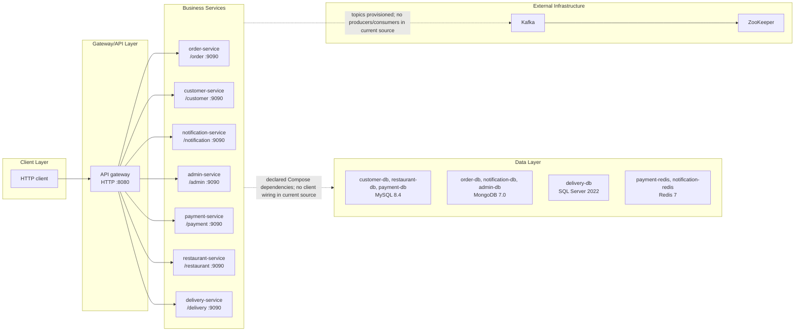
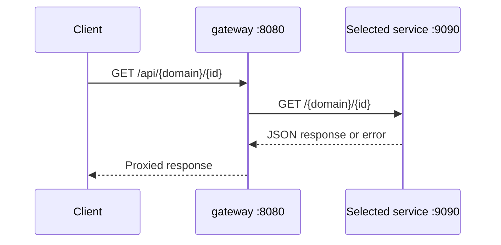
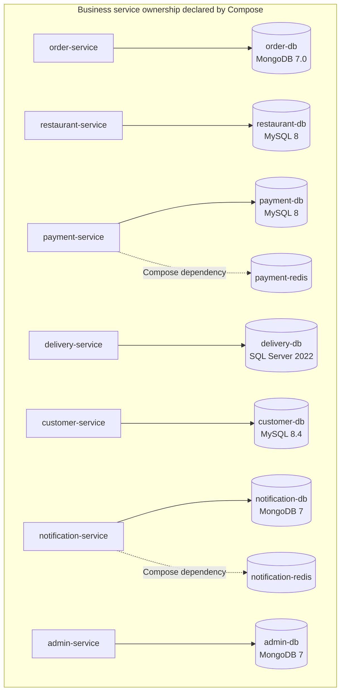
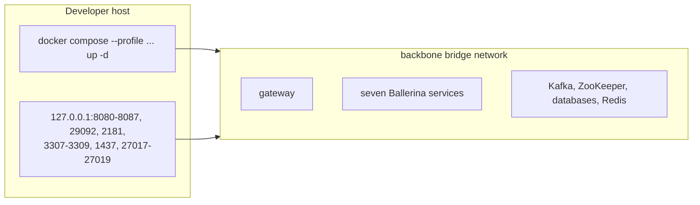

# Assignment 2 — Food Delivery Service Scaffold

This document describes the implemented Assignment 2 application and its local Docker infrastructure. It reflects actual repository wiring; provisioned infrastructure that is not currently referenced by source code is explicitly identified.

## Architecture overview


```mermaid
flowchart LR
    subgraph C[Client Layer]
        Client[HTTP client]
    end
    subgraph G[Gateway/API Layer]
        Gateway[API gateway\nHTTP :8080]
    end
    subgraph B[Business Services]
        Order[order-service\n/order :9090]
        Customer[customer-service\n/customer :9090]
        Notification[notification-service\n/notification :9090]
        Admin[admin-service\n/admin :9090]
        Payment[payment-service\n/payment :9090]
        Restaurant[restaurant-service\n/restaurant :9090]
        Delivery[delivery-service\n/delivery :9090]
    end
    subgraph D[Data Layer]
        MySQL[customer-db, restaurant-db, payment-db\nMySQL 8.4]
        Mongo[order-db, notification-db, admin-db\nMongoDB 7.0]
        MSSQL[delivery-db\nSQL Server 2022]
        Redis[payment-redis, notification-redis\nRedis 7]
    end
    subgraph E[External Infrastructure]
        Kafka[Kafka]
        ZK[ZooKeeper]
    end
    Client --> Gateway
    Gateway --> Order
    Gateway --> Customer
    Gateway --> Notification
    Gateway --> Admin
    Gateway --> Payment
    Gateway --> Restaurant
    Gateway --> Delivery
    B -. declared Compose dependencies; no client wiring in current source .-> D
    B -. topics provisioned; no producers/consumers in current source .-> Kafka
    Kafka --> ZK
```

All components attach to the Docker bridge network `backbone`, as declared in
[docker-compose.yml](infra/docker/docker-compose.yml).

## Component catalog and responsibilities

| Component | Current responsibility | Internal port | Host port | Evidence |
| --- | --- | ---: | ---: | --- |
| `gateway` | REST entry point and reverse proxy | 8080 | 8080 | [gateway/service.bal](gateway/service.bal) |
| `order-service` | `/order/health` and order resources | 9090 | 8081 | [orderService/service.bal](services/orderService/service.bal), [Compose](infra/docker/docker-compose.yml) |
| `customer-service` | Customer resources | 9090 | 8082 | [customerService/service.bal](services/customerService/service.bal), [Compose](infra/docker/docker-compose.yml) |
| `notification-service` | Notification resources | 9090 | 8083 | [notificationService/service.bal](services/notificationService/service.bal), [Compose](infra/docker/docker-compose.yml) |
| `payment-service` | Payment resources | 9090 | 8084 | [paymentService/service.bal](services/paymentService/service.bal), [Compose](infra/docker/docker-compose.yml) |
| `admin-service` | Admin and DLQ resources | 9090 | 8085 | [adminService/service.bal](services/adminService/service.bal), [Compose](infra/docker/docker-compose.yml) |
| `delivery-service` | Delivery resources | 9090 | 8086 | [deliveryService/service.bal](services/deliveryService/service.bal), [Compose](infra/docker/docker-compose.yml) |
| `restaurant-service` | Restaurant resources | 9090 | 8087 | [restaurantService/service.bal](services/restaurantService/service.bal), [Compose](infra/docker/docker-compose.yml) |

The seven business services expose typed HTTP resources with validation and
state guards. Kafka/database adapters are isolated behind the service
boundaries; the local demo profile uses deterministic seed data and the
contracts package under `shared/contracts`.

## Gateway routes and request flow


```mermaid
sequenceDiagram
    participant C as Client
    participant G as gateway :8080
    participant S as Selected service :9090
    C->>G: GET /api/{domain}/{id}
    G->>S: GET /{domain}/{id}
    S-->>G: JSON response or error
    G-->>C: Proxied response
```

Routes are declared in [gateway/service.bal](gateway/service.bal):

| Gateway route | Client target | Internal downstream URL |
| --- | --- | --- |
| `GET /api/orders/{id}` | Order | `http://order-service:9090/order/{id}` |
| `GET /api/customer/{id}` | Customer | `http://customer-service:9090/customer/{id}` |
| `GET /api/notifications/{id}` | Notification | `http://notification-service:9090/notification/{id}` |
| `GET /api/payments/{id}` | Payment | `http://payment-service:9090/payment/{id}` |
| `GET /api/admin/{id}` | Admin | `http://admin-service:9090/admin/{id}` |
| `GET /api/delivery/{id}` | Delivery | `http://delivery-service:9090/delivery/{id}` |
| `GET /api/restaurant/{id}` | Restaurant | `http://restaurant-service:9090/restaurant/{id}` |
| `GET /api/health` | Gateway | Static gateway health response |

The service names are used as Docker DNS hostnames and `9090` is the
container-side port, as configured in [docker-compose.yml](infra/docker/docker-compose.yml).

## Data and external infrastructure

### Database ownership


```mermaid
flowchart TB
    subgraph Services[Business service ownership declared by Compose]
        O[order-service] --> ODB[(order-db\nMongoDB 7.0)]
        R[restaurant-service] --> RDB[(restaurant-db\nMySQL 8)]
        P[payment-service] --> PDB[(payment-db\nMySQL 8)]
        D[delivery-service] --> DDB[(delivery-db\nSQL Server 2022)]
        C[customer-service] --> CDB[(customer-db\nMySQL 8.4)]
        N[notification-service] --> NDB[(notification-db\nMongoDB 7)]
        A[admin-service] --> ADB[(admin-db\nMongoDB 7)]
        P -. Compose dependency .-> PR[(payment-redis)]
        N -. Compose dependency .-> NR[(notification-redis)]
    end
```

Compose declares these dependencies and volumes. The service packages expose
typed resource boundaries and the database schema/seed files establish the
ownership contract; the current local service implementation keeps its
business state in memory until the connector-backed persistence adapter is
enabled.

Kafka topics are created by the one-shot `kafka-init` container from
[create-topics.sh](infra/docker/kafka/create-topics.sh). It verifies the exact
46-topic inventory (23 base topics and one lowercase `.dlq` per topic). Kafka
runs with ZooKeeper coordination and plaintext listeners.

The event contract is defined in
[shared/contracts/types.bal](shared/contracts/types.bal): every event has an
ID, type, UTC timestamp, order key, correlation ID and mandatory order
summary. The development broker uses three partitions and replication factor
one; production should use at least three brokers and replication factor three.

### Verification

```powershell
Set-Location Assignment-2\shared\contracts; bal test
Set-Location ..\services\orderService; bal test
Set-Location ..\..\gateway; bal build
docker compose --env-file infra\docker\.env.example -f infra\docker\docker-compose.yml config --quiet
```

Start a clean local stack with
`infra\docker\scripts\start-dev.ps1`, select the `all` profile, and use
`infra\docker\scripts\reset-dev-data.ps1` only when destructive volume reset
is intended. Internal validation routes containing `/internal/` are rejected
by the gateway and are available only on the owning service.

## Docker and container architecture


```mermaid
flowchart LR
    subgraph Host[Developer host]
        Compose[docker compose --profile ... up -d]
        Ports[127.0.0.1:8080-8087, 29092, 2181,\n3307-3309, 1437, 27017-27019]
    end
    subgraph Net[backbone bridge network]
        G[ gateway ]
        S[ seven Ballerina services ]
        I[ Kafka, ZooKeeper, databases, Redis ]
    end
    Compose --> Net
    Ports --> Net
```

All eight application images use the same two-stage Dockerfile pattern:
Ballerina build image, `bal build --offline=false`, then Eclipse Temurin 21
JRE with the generated JAR. See [gateway/Dockerfile](gateway/Dockerfile) and
the equivalent service Dockerfiles.

Named volumes are declared in [docker-compose.yml](infra/docker/docker-compose.yml):

- `order-db-data`
- `restaurant-db-data`
- `payment-db-data`
- `delivery-db-data`
- `customer-db-data`
- `notification-db-data`
- `admin-db-data`
- `payment-redis-data`
- `notification-redis-data`

## Profiles and ports

Every profile starts the shared gateway, Kafka, ZooKeeper and topic initializer. Application/database membership is defined in [docker-compose.yml](infra/docker/docker-compose.yml).

| Profile | Application services | Supporting services |
| --- | --- | --- |
| `order-customer` | order `8081`, customer `8082` | order MongoDB `27017`, customer MySQL `3307` |
| `notification-admin` | notification `8083`, admin `8085` | notification MongoDB `27018`, admin MongoDB `27019`, notification Redis (internal only) |
| `restaurant-payment` | restaurant `8087`, payment `8084` | restaurant MySQL `3308`, payment MySQL `3309`, payment Redis (internal only) |
| `delivery` | delivery `8086` | delivery MSSQL `1437` |
| `all` | all seven services | all databases and both Redis instances |

Host clients use gateway `localhost:8080`, Kafka `localhost:29092`, and
ZooKeeper `localhost:2181`. Containers use `kafka:9092`; application services
use port `9090` internally. Published ports bind to loopback by default.

### Connection table

Use the host values for tools running on the developer machine. Services inside
Compose use the database service name and container port instead.

| Service | Host | Port | Username | Password variable | Authentication database |
| --- | --- | ---: | --- | --- | --- |
| order-db (MongoDB) | `localhost` | 27017 | `order_app` | `ORDER_DB_APP_PASSWORD` | `orders` |
| customer-db (MySQL) | `localhost` | 3307 | `customer_app` | `CUSTOMER_DB_APP_PASSWORD` | `customer` |
| restaurant-db (MySQL) | `localhost` | 3308 | `restaurant_app` | `RESTAURANT_DB_APP_PASSWORD` | `restaurant` |
| payment-db (MySQL) | `localhost` | 3309 | `payment_app` | `PAYMENT_DB_APP_PASSWORD` | `payment` |
| notification-db (MongoDB) | `localhost` | 27018 | `notification_app` | `NOTIFICATION_DB_APP_PASSWORD` | `notifications` |
| admin-db (MongoDB) | `localhost` | 27019 | `admin_app` | `ADMIN_DB_APP_PASSWORD` | `admin` |
| delivery-db (SQL Server) | `localhost` | 1437 | `sa` | `DELIVERY_DB_PASSWORD` | `master` |

## Configuration and secrets

[.env.example](infra/docker/.env.example) defines `COMPOSE_PROJECT_NAME`,
database host ports, `MONGO_ROOT_USER` and `COMPOSE_PARALLEL_LIMIT`.
[start-dev.ps1](infra/docker/scripts/start-dev.ps1) generates local database
passwords into the ignored `.env`; no secret values are documented here.

The gateway's configurable Ballerina values, including downstream URLs and
timeout, are supplied through `BAL_CONFIG_DATA` in
[docker-compose.yml](infra/docker/docker-compose.yml). Local values and
password placeholders are listed in [.env.example](infra/docker/.env.example).

## Development setup

From `Assignment-2/infra/docker`:

```powershell
cd Assignment-2/infra/docker
.\scripts\start-dev.ps1
```

The script creates `.env` if missing, generates local passwords once, prompts for a profile and runs Compose. Existing containers can be stopped/started with:

```powershell
.\scripts\stop-containers.ps1
.\scripts\start-containers.ps1
```

To remove selected profile volumes so databases reinitialize with the current
`.env` credentials:

```powershell
.\scripts\reset-dev-data.ps1
```

Do not expose, submit, or commit `.env`; submit/share
[.env.example](infra/docker/.env.example) instead. Database initialization
credentials are retained in persistent volumes; regenerating `.env` without
resetting affected volumes can cause authentication failures.

## Health checks

Compose checks:

- Gateway: `GET http://localhost:8080/api/health`
- Services: `GET http://localhost:9090/<service>/health`
- Kafka with `kafka-topics`
- ZooKeeper with a TCP port probe
- MySQL with an authenticated `SELECT 1`
- MongoDB with authenticated `mongosh`
- MSSQL with `sqlcmd`
- Redis with `redis-cli ping`

Evidence: [docker-compose.yml](infra/docker/docker-compose.yml).

## Technologies and observability

- Ballerina HTTP services and gateway.
- Docker Compose v2.20+ and bridge networking.
- Docker Desktop with enough memory for the selected profile; measure the full
  profile with `docker stats` and use at least the observed peak plus headroom.
- Confluent Kafka/ZooKeeper.
- MySQL 8, MongoDB 7, SQL Server 2022 and Redis 7.
- Java 21 JRE application runtime.
- Ballerina built-in observability included in each package, for example
  [gateway/Ballerina.toml](gateway/Ballerina.toml).

No metrics exporter, tracing backend, dashboard, alerting configuration or centralized logging configuration is present.

## Known inconsistencies

1. Service tests and image builds must remain aligned with the `/.../health`
   endpoints; the build pipeline should be checked after dependency fixes.
2. No `restart` policies are configured; this is intentional for local
   development.
3. No CI/CD or production deployment infrastructure exists. The files under
   [infra/k8s](infra/k8s) are deployment scaffolds, not a verified deployment.

## Architecture verification checklist

- Validate Compose from this directory with `docker compose config --quiet`.
- Confirm selected profile membership before expecting a gateway route to work.
- Check `docker compose ps` and each health endpoint.
- Treat health `UP` as process availability only.
- Confirm the `curl` and MSSQL tooling assumptions against the built images.
- Inspect source before assuming Kafka, Redis or database behavior; those integrations are not currently implemented.
