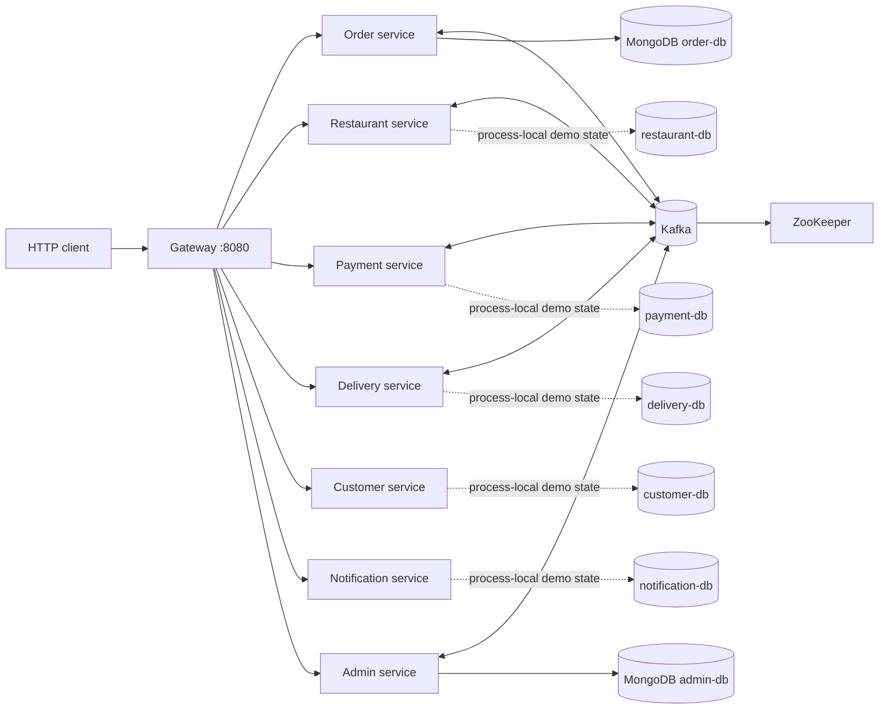

# Assignment 2 architecture

All application containers listen on port 9090 internally. The gateway is the
supported client entry point. Only order and admin state is durable in the
current development runtime; the remaining service state is process-local.
