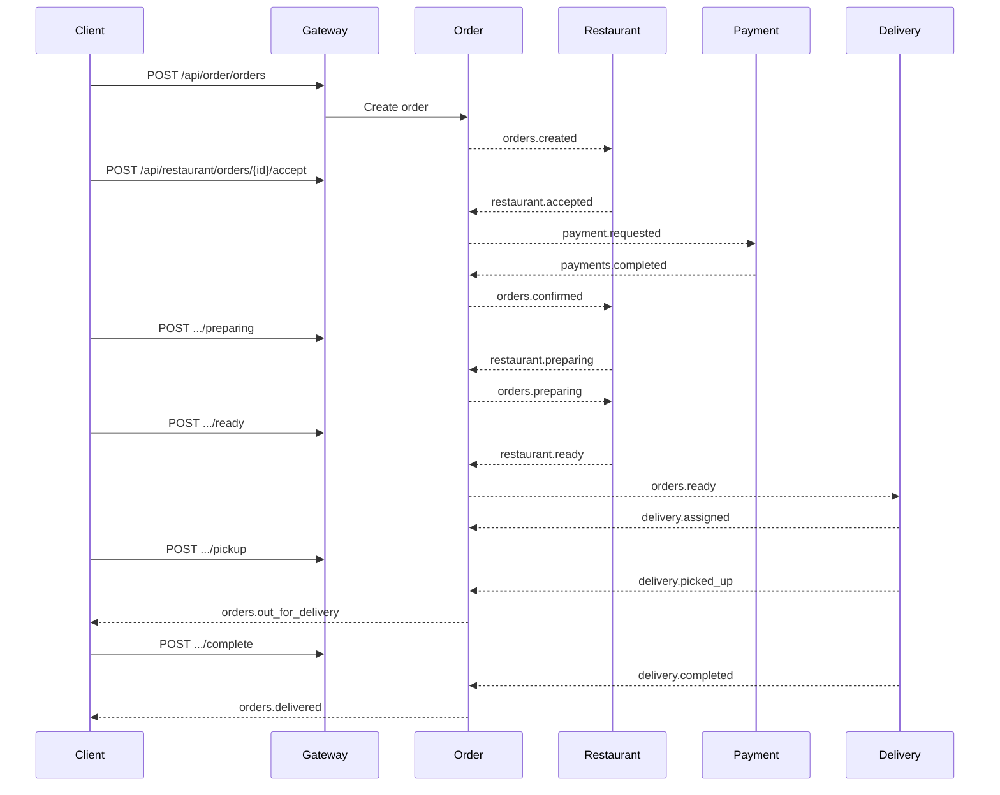

# AT-1 happy-path sequence

```mermaid
sequenceDiagram
    participant C as Client
    participant G as Gateway
    participant O as Order
    participant R as Restaurant
    participant P as Payment
    participant D as Delivery
    C->>G: POST /api/order/orders
    G->>O: Create order
    O-->>R: orders.created
    C->>G: POST /api/restaurant/orders/{id}/accept
    R-->>O: restaurant.accepted
    O-->>P: payment.requested
    P-->>O: payments.completed
    O-->>R: orders.confirmed
    C->>G: POST .../preparing
    R-->>O: restaurant.preparing
    O-->>R: orders.preparing
    C->>G: POST .../ready
    R-->>O: restaurant.ready
    O-->>D: orders.ready
    D-->>O: delivery.assigned
    C->>G: POST .../pickup
    D-->>O: delivery.picked_up
    O-->>C: orders.out_for_delivery
    C->>G: POST .../complete
    D-->>O: delivery.completed
    O-->>C: orders.delivered
```

The acceptance script prints Kafka timestamps, keys, event IDs, distinct-topic
assertions, and same-event-ID redelivery notices.
