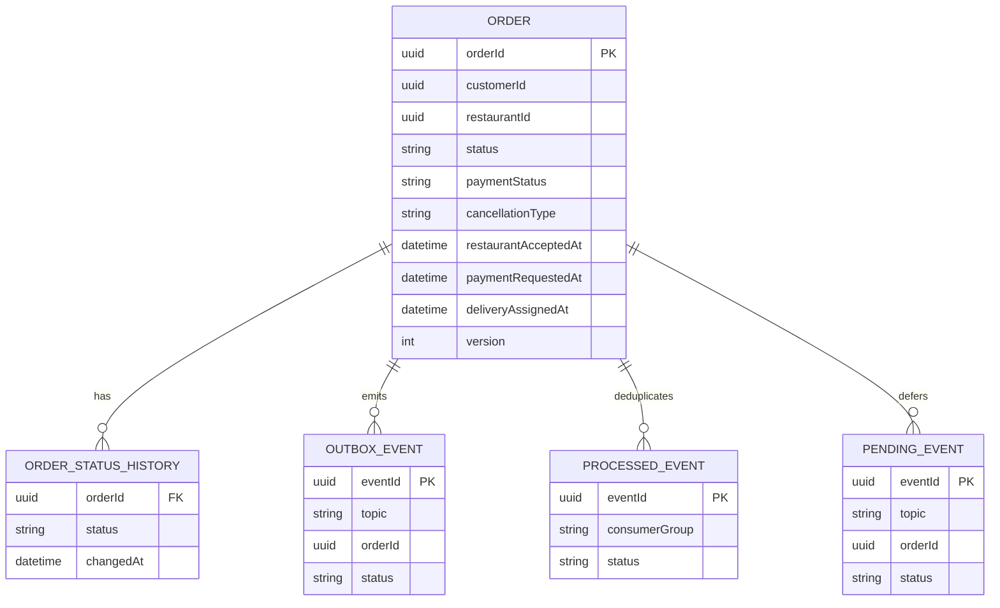

# Data model

```mermaid
erDiagram
    ORDER ||--o{ ORDER_STATUS_HISTORY : has
    ORDER ||--o{ OUTBOX_EVENT : emits
    ORDER ||--o{ PROCESSED_EVENT : deduplicates
    ORDER ||--o{ PENDING_EVENT : defers
    ORDER {
        uuid orderId PK
        uuid customerId
        uuid restaurantId
        string status
        string paymentStatus
        string cancellationType
        datetime restaurantAcceptedAt
        datetime paymentRequestedAt
        datetime deliveryAssignedAt
        int version
    }
    ORDER_STATUS_HISTORY {
        uuid orderId FK
        string status
        datetime changedAt
    }
    OUTBOX_EVENT {
        uuid eventId PK
        string topic
        uuid orderId
        string status
    }
    PROCESSED_EVENT {
        uuid eventId PK
        string consumerGroup
        string status
    }
    PENDING_EVENT {
        uuid eventId PK
        string topic
        uuid orderId
        string status
    }
```

The order service persists snapshots and recovery collections in MongoDB.
Other service state is process-local in the current development demo.
