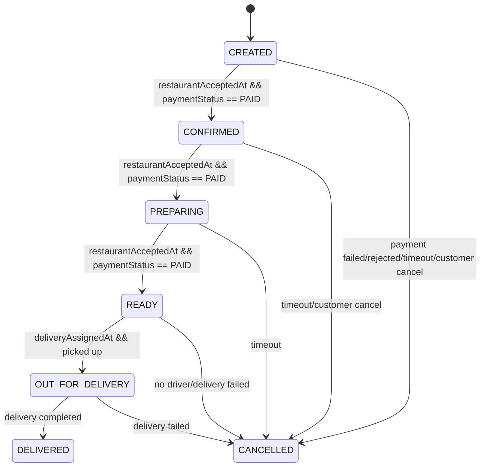

# Order state machine

Guard fields include `restaurantAcceptedAt`, `paymentRequestedAt`,
`deliveryAssignedAt`, `paymentStatus`, and the persisted status/version.
Conditional transitions reject stale or invalid events.
