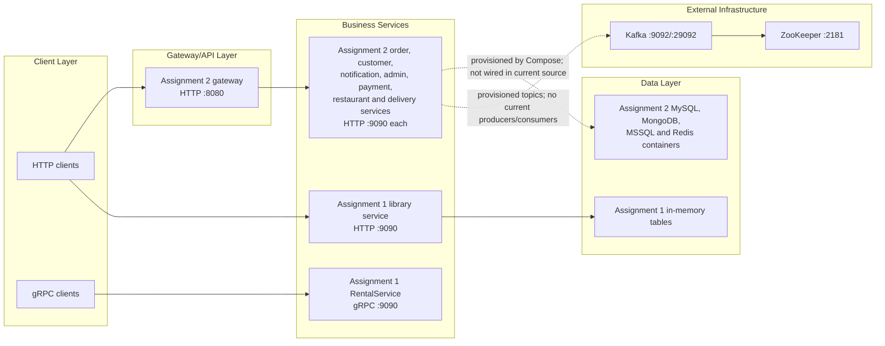

# Distributed Systems Applications

Architecture and infrastructure documentation for the two Ballerina assignments in this repository.

## Repository scope

| Assignment | System | Primary runtime | Persistence/dependencies |
| --- | --- | --- | --- |
| [Assignment 1](Assignment-1/README.md) | Asset and institution HTTP service plus RentalService gRPC contract/server | Ballerina 2201.13.4 | In-memory Ballerina tables; no database |
| [Assignment 2](Assignment-2/README.md) | Food-delivery gateway and service scaffold | Ballerina 2201.13.4 packages, Docker build image 2201.13.5, Java 21 runtime | Docker Compose with Kafka/ZooKeeper, MySQL, MongoDB, MSSQL and Redis |

## High-level architecture

The diagrams and claims in this repository documentation are derived from the source, package manifests, Dockerfiles, Compose file, scripts and tests. Assignment 2’s databases, Redis instances and Kafka topics are provisioned by infrastructure, but the current service source exposes only health endpoints and does not import those clients.

## Development prerequisites

- Ballerina and the Ballerina VS Code extension for source work.
- Docker Desktop and PowerShell for Assignment 2 Compose development.
- Git.

See the assignment documents for commands, ports, profiles, API entry points, health checks and troubleshooting.

## Verification notes

- Assignment 1 uses process-local tables, so data is lost when the process restarts.
- Assignment 2 is local Docker Compose infrastructure; no CI/CD workflow, production deployment manifest, Kubernetes manifest, Helm chart or Terraform configuration is present.
- Compose health checks validate process/container readiness. Assignment 2 application health endpoints return static `UP` responses and do not verify database, Kafka or Redis connectivity.
- Assignment 2 service tests currently target `/greeting`, while implementations expose `/.../health`; see [Assignment-2/README.md](Assignment-2/README.md#known-inconsistencies).
